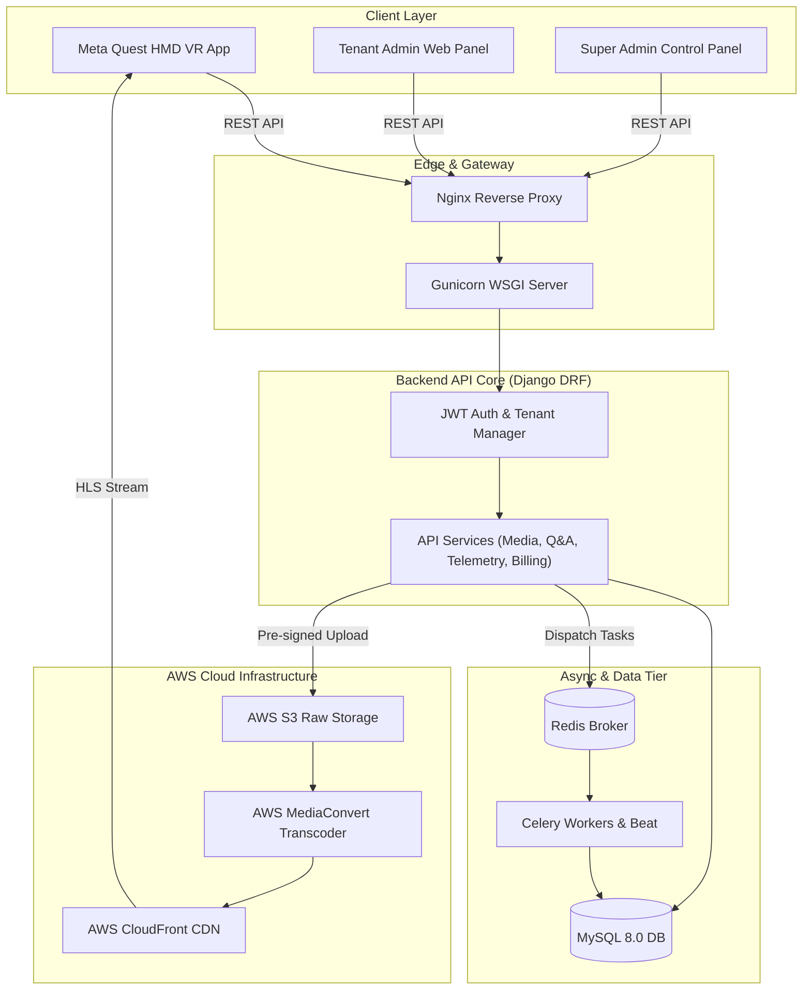

# 1-xr: Enterprise Multi-Tenant XR/VR Training & Telemetry Platform
## Portfolio Engineering Case Study

> **One-Line Overview:** Enterprise B2B Extended Reality (XR/VR) training & analytics platform enabling tactical security simulations on Meta Quest headsets with spatial telemetry, adaptive 360° streaming, and usage-based tenant billing.

| Attribute | Details |
| :--- | :--- |
| **Role & Focus** | Cloud Backend Architect & VR Telemetry Pipeline Engineer |
| **Category** | B2B Enterprise XR/VR, Tactical Simulation, Telemetry Analytics |
| **Tech Stack** | Python 3.11, Django 4.2+, DRF, Meta Quest (Quest 2/3/Pro), AWS MediaConvert, S3, CloudFront, Celery, Redis, MySQL 8.0 |
| **Key Impact** | **99.5% reduction** in VR telemetry network requests; **100% multi-tenant data ring-fencing** at ORM layer; **Server-authoritative** timed assessment state engine. |

---

## 1. Executive Summary & Core Challenge

### Context
**1-xr** replaces passive classroom instruction for tactical security operatives and emergency responders with hyper-realistic, interactive 360° video scenarios on **Meta Quest (2, 3, Pro)** and **Android VR** headsets. Operatives navigate high-pressure incidents while being evaluated on real-time situational awareness, threat detection, push-to-talk (PTT) radio communications, and spatial memory recall.

### The Core Challenge
Building an enterprise VR platform introduced three severe engineering hurdles:
1. **Network & Battery Strain:** Streaming 4K/8K 360° video while continuously logging ~4 Hz spatial gaze & head-pose vectors over Wi-Fi quickly drained headset battery and caused packet drops.
2. **Assessment Integrity:** Client-side local timers on VR headsets allowed users to tamper with system clocks or pause decision windows during evaluations.
3. **Enterprise Privacy & Billing:** Enterprise corporate clients required strict white-labeling and isolated database access, alongside itemized billing for AWS transcode compute seconds and CDN bandwidth.

---

## 2. System Architecture

The architecture decouples the immersive Quest VR client from management web dashboards and cloud transcode pipelines via a ring-fenced Django REST backend.



---

## 3. Platform Capabilities

- **Meta Quest Headset Client:** Interactive 360° video playback with controller button see-through guidance, Push-to-Talk (PTT) left-trigger radio simulation with real-time HUD waveform feedback, and spatial gaze tracking.
- **Tenant White-Label Dashboard:** Allows client organization admins to customize corporate branding (logos, hex colors, splash screens, onboarding cards), inspect participant gaze dwell heatmaps, and download usage invoice PDFs.
- **Super Admin Platform Control:** Centralized plane for tenant provisioning, global landing CMS management, and setting tier rates for storage, CDN bandwidth, and AWS MediaConvert processing (`STANDARD`, `PREMIUM`, `EXTREME`).
- **AWS MediaConvert Transcode Pipeline:** Automated 4K/8K 360° video encoding into multi-bitrate HLS streams (`240p` to `2160p`) delivered globally via CloudFront.

---

## 4. Key Engineering Challenges & Technical Solutions

### Challenge 1: VR Spatial Telemetry Network & Battery Strain
- **Problem:** Sampling spatial gaze and head-pose vectors at ~4 Hz produced hundreds of payload objects per minute. Sending individual HTTP requests over Wi-Fi drained Quest battery life and clogged network bandwidth.
- **Solution:** Engineered a **Batched Telemetry Ingestion Engine** (`/api/results/tracking/telemetry-batch/`). The VR headset buffers orientation vectors locally in memory during scenario playback and transmits a single compressed JSON payload containing aggregated grid dwell times (`zone_dwell_ms`) upon completion.
- **Result:** **Reduced network request overhead by 99.5%**, eliminated Wi-Fi latency spikes, and extended headset battery endurance during multi-user drills.

### Challenge 2: Client-Side Timer Manipulation in Assessments
- **Problem:** Operatives could manipulate client system clocks or delay answering decision pop-ups to gain unfair scoring advantages.
- **Solution:** Implemented a **Server-Authoritative Timed Q&A State Machine**. When a question is requested, the server locks an exact deadline (`deadline_at = opened_at + timeout_ms`). When the answer is submitted, the backend evaluates the response against internal server time. Overdue answers are automatically marked `timed_out` with zero score.
- **Result:** Completely eliminated timer tampering and guaranteed identical, standardized assessment conditions across all corporate tenants.

### Challenge 3: Shared Database Multi-Tenant Ring Fencing
- **Problem:** Cross-tenant data leaks in enterprise SaaS platforms introduce critical security vulnerabilities.
- **Solution:** Built custom Django ORM managers (`TenantManager`) coupled with JWT authentication middleware that injects `tenant_id` into every database query context. Added strict ORM save hooks preventing tenant users from acquiring `is_superuser` privileges.
- **Result:** Guaranteed **100% data separation** at the framework level without requiring costly single-tenant database infrastructure.

---

## 5. Architectural Trade-offs & Decisions

| Strategy Selected | Alternative Considered | Trade-off / Rationale |
| :--- | :--- | :--- |
| **JWT Tenant Claim Injection** | Manual URL path `tenant_id` passing | Token payload carries scope cleanly; revocation requires a short-lived Redis blacklist. |
| **Pre-signed S3 Upload URLs** | Uploading master 4K VR files via Django API | Completely bypasses application memory limits; requires client upload state handling. |
| **AWS MediaConvert + Celery Polling** | Local FFmpeg CPU transcoding on server | Avoids heavy CPU spikes on web instances; introduces AWS service transcode cost. |
| **Usage-Based Cost Accounting** | Fixed monthly subscription fee | Accurately charges clients based on S3 storage, CDN egress GB, and MediaConvert processing seconds. |

---

## 6. Results, Impact & Technology Summary

### Quantitative Impact
- **99.5% Reduction in VR Telemetry Requests:** Batched array ingestion preserved network stability on standalone VR hardware.
- **Zero Data Leakage:** Framework-enforced ORM scoping ensured complete multi-tenant privacy.
- **Automated Billing:** Usage-based cost accounting generated itemized monthly tenant invoices with zero manual intervention.

### Technology Summary

```
Client Layer:       Meta Quest 2/3/Pro Client, Vanilla JS/CSS Admin Web Apps
Backend Framework:  Python 3.11, Django 4.2+, Django REST Framework, JWT
Data & Queue Tier:  MySQL 8.0+, Redis 6.0+, Celery 5.3+ Workers & Celery Beat
Cloud & Streaming:  AWS S3, AWS MediaConvert, AWS CloudFront CDN, Nginx, Gunicorn
```
