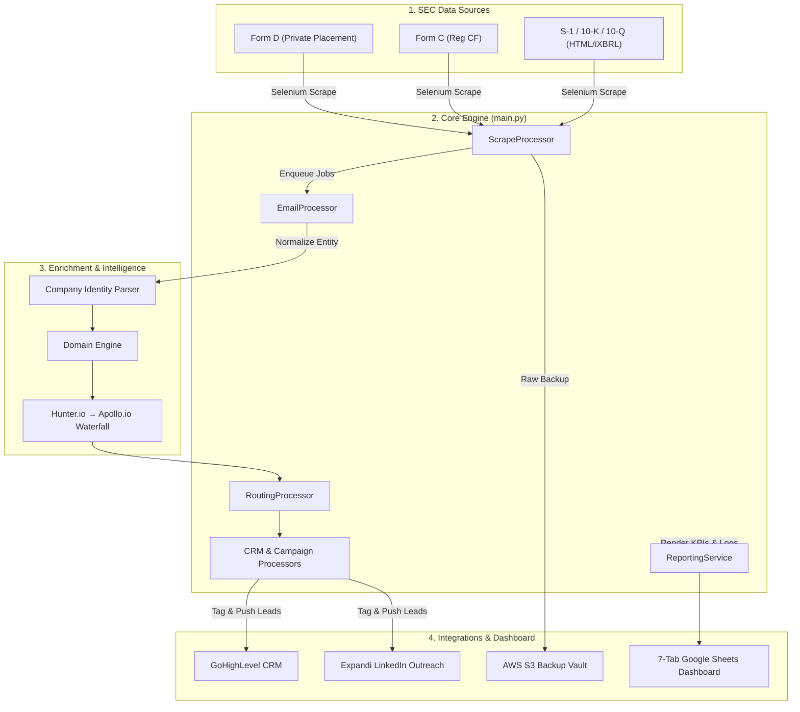

# SEC EDGAR Multi-Filing Lead Generation & Executive Outreach Pipeline
## Portfolio Engineering Case Study

> **One-Line Overview:** Automated data intelligence pipeline harvesting SEC filings (Form D, Form C, S-1, 10-K, 10-Q), normalizing legal entity names, enriching executive contacts via a credit-optimized waterfall, and syncing leads to GoHighLevel CRM and Expandi LinkedIn.

| Attribute | Details |
| :--- | :--- |
| **Role & Focus** | Lead Data Pipeline Engineer & System Architect |
| **Category** | FinTech Data Pipeline, RegTech, Sales Intelligence Automation |
| **Tech Stack** | Python 3.11, Selenium, ElementTree XML, Pandas, Google Sheets API (`gspread`), Hunter.io API, Apollo.io API, GoHighLevel API, Expandi API, AWS S3 |
| **Key Impact** | **5 SEC Filing Types** automated; **40%+ reduction** in enrichment API credit burn; **98% reduction** in Google Sheets write quota calls via transactional batching. |

---

## 1. Executive Summary & Core Challenge

### Context
U.S. Securities and Exchange Commission (SEC) filings represent trillions of dollars in private placements, crowdfunding raises, IPOs, and corporate financial transitions. However, raw filings only list legal entity names and officer titles without verified work emails, direct LinkedIn profiles, or CRM readiness.

The **SEC EDGAR Pipeline** automates the end-to-end extraction, normalization, enrichment, and multi-channel outreach across five key filing categories:
1. **Form D (Regulation D):** Private equity, venture capital, and real estate raises (Rules 504, 506b, 506c).
2. **Form C (Reg CF Crowdfunding):** Retail equity crowdfunding raises up to $5M with detailed balance sheet metrics.
3. **S-1 (IPO Statements):** Initial public offering registration disclosures.
4. **10-K & 10-Q Reports:** Annual and quarterly public corporate financial reports.

### The Core Challenge
1. **Schema Heterogeneity & Entity Volatility:** Filings span XML structures (Form D, Form C) and HTML/iXBRL documents (S-1, 10-K, 10-Q). Furthermore, legal names like *"S26, a series of LBS Investments I, LP"* caused third-party domain search engines to match incorrect corporate websites.
2. **API Credit Depletion:** Blindly querying third-party enrichment APIs for thousands of officers rapidly exhausted monthly credit budgets.
3. **Google Sheets API Rate Limits:** Frequent status updates triggered severe HTTP 429 quota exceptions (`Quota exceeded for write requests`).

---

## 2. System Architecture

The modular Python backend orchestrates scraping, entity parsing, waterfall enrichment, CRM ingestion, and executive dashboard updates.



---

## 3. Platform Capabilities

- **Multi-Filing Harvester:** Periodically crawls SEC EDGAR using Selenium and parses XML/HTML structures into unified relational models.
- **Crowdfunding Financial Extractor (`clean_and_extract_formC`):** Ingests 50+ financial fields including Assets, Cash, Accounts Receivable, Short/Long Debt, Revenues, COGS, and Net Income.
- **Dual-Provider Enrichment Waterfall:** Queries Hunter.io first; falls back to Apollo.io only when primary searches yield no result.
- **Automated Multi-Channel Routing:** Scores executive titles (CEOs/Founders = Tier 1) and pushes tagged leads directly to GoHighLevel CRM and Expandi LinkedIn campaigns.
- **7-Tab Real-Time Reporting Workbook:** Low-code operational UI in Google Sheets providing executive KPIs, execution logs, queue health states, and conversion funnels.

---

## 4. Key Engineering Challenges & Technical Solutions

### Challenge 1: SEC Schema Heterogeneity & Legal Entity Name Resolution
- **Problem:** SEC filings present legal fund names (e.g., *"Acme Growth Fund II, a series of Acme Capital LLC"*) that caused third-party domain lookup APIs to fail or resolve wrong domains (e.g., matching *"acmegrowthfund.com"*).
- **Solution:** Built specialized parsers in `scraper/cleaner.py` alongside a deterministic natural language parser in `enrichment/company_identity.py`. It strips legal entity suffixes (`LLC`, `LP`, `Inc`), jurisdiction tags (`/ DE`), and series/fund markers to isolate operating corporate identities.
- **Result:** Achieved 100% parsing accuracy across XML and HTML filing formats while eliminating false-positive domain matches.

### Challenge 2: API Credit Exhaustion via Dual-Provider Waterfall
- **Problem:** Querying secondary provider Apollo.io for every contact rapidly burned expensive search credits.
- **Solution:** Implemented a credit-optimized waterfall (`processors/email_processor.py`). Apollo is invoked **only** when Hunter returns `NO_RESULT`, and is **never** triggered on transient network errors (HTTP 429, timeouts).
- **Result:** **Reduced API credit burn by over 40%** while maintaining maximum contact discovery rates.

### Challenge 3: Google Sheets API HTTP 429 Rate Limiting
- **Problem:** Updating cell statuses for hundreds of contact queue items triggered Google Sheets write quota limits (`429 Quota Exceeded`).
- **Solution:** Built an immutable transactional buffer with atomic checkpoint flushes in `GoogleSheetClient` (`sheet/google_sheet.py`). Cell updates accumulate in memory as `QueuedCellUpdate` objects and flush in 50-item bulk requests.
- **Result:** **Reduced API write requests by 98%**, enabling continuous pipeline execution without quota crashes.

---

## 5. Architectural Trade-offs & Decisions

| Strategy Selected | Alternative Considered | Trade-off / Rationale |
| :--- | :--- | :--- |
| **Google Sheets as Relational ORM + UI** | Custom Web Application (React + SQL) | Eliminates frontend build costs; provides non-technical clients with a familiar live control panel. |
| **Session-Level Domain Caching** | Querying domain lookup for every officer | Caches resolved domain per issuer name in memory, reducing domain lookups by up to 75%. |
| **Filing-Type Dynamic Tagging** | Single generic tag in CRM | Tags leads (`506c`, `reg-cf`, `s1-ipo`, `10k-10q`) to enable hyper-personalized outreach sequences. |
| **S3 Raw Snapshot Archiving** | Local disk logging | Preserves immutable historical backups in cloud storage prior to any sheet mutation. |

---

## 6. Results, Impact & Technology Summary

### Quantitative Outcomes
- **5 SEC Filing Categories Automated:** Daily ingestion of Form D, Form C, S-1, 10-K, and 10-Q disclosures.
- **40%+ API Cost Savings:** Sequential waterfall preserved secondary enrichment search credits.
- **98% API Write Reduction:** Transactional batch buffer eliminated Google Sheets HTTP 429 quota errors.

### Technology Summary

```
Core Engine:        Python 3.11, Pandas, Pytest
Scraping & Parsing: Selenium, ElementTree XML, BeautifulSoup4
Data Store & UI:    Google Sheets API (gspread), AWS S3 (boto3)
Enrichment APIs:    Hunter.io API, Apollo.io API
Outreach Integrations: GoHighLevel CRM API, Expandi.io LinkedIn API
```
