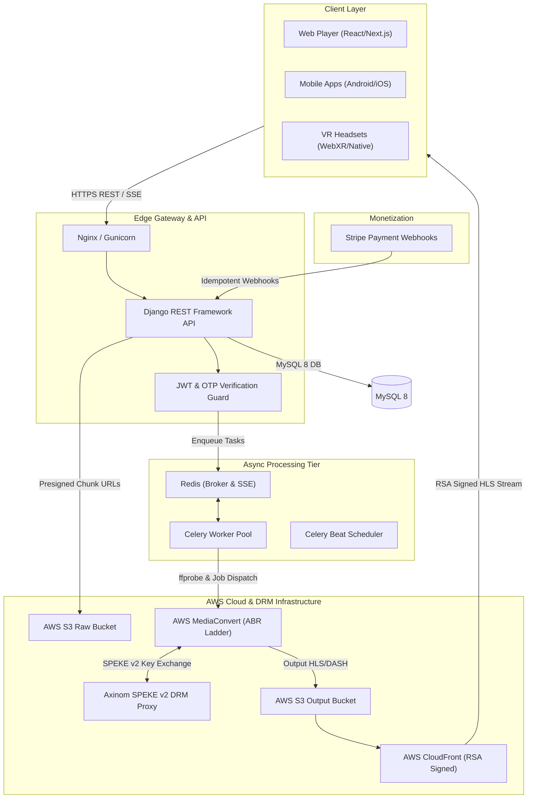

# Urview: Enterprise OTT & Immersive VR Streaming Platform
## Portfolio Engineering Case Study

> **One-Line Overview:** Next-generation Over-The-Top (OTT) VOD and live streaming engine delivering flat HD/4K content and immersive 180°/360° Virtual Reality media with studio-grade SPEKE v2 DRM and hybrid Stripe monetization.

| Attribute | Details |
| :--- | :--- |
| **Role & Focus** | Lead Media Infrastructure Architect & Backend Engineer |
| **Category** | Enterprise OTT Platform, Video Infrastructure, Immersive VR Media |
| **Tech Stack** | Python 3.12, Django 5.2, DRF, AWS MediaConvert, AWS S3, AWS CloudFront, Axinom SPEKE v2 DRM (Widevine & FairPlay), Stripe API, Celery, Redis, MySQL 8 |
| **Key Impact** | **50GB+ VR video uploads** bypassed application server memory via presigned multipart S3 chunks; **8MB constant RAM limit** during Google Drive ingests; **Studio-grade DRM & RSA signed CDN streaming**. |

---

## 1. Executive Summary & Core Challenge

### Context
**Urview** is an enterprise OTT streaming platform engineered to ingest, process, protect, monetize, and stream high-definition flat video alongside ultra-high-resolution Virtual Reality (VR 180° and VR 360° monoscopic/stereoscopic) media assets across web browsers, mobile devices, and standalone VR headsets.

### The Core Challenge
1. **Server Ingestion Bottlenecks:** Master 360° 3D VR files reach 50GB+. Processing multi-gigabyte uploads through standard app servers exhausted worker memory and caused gateway timeouts.
2. **Content Protection & DRM:** Preventing content piracy required multi-platform Digital Rights Management (DRM) support for both Google Widevine and Apple FairPlay, alongside secure edge streaming controls.
3. **Hybrid Monetization Reliability:** Webhooks for Subscription Video-on-Demand (SVOD) and Pay-Per-View (TVOD) transactions can arrive out of order or duplicate, risking entitlement state desynchronization.

---

## 2. System Architecture

The architecture decouples synchronous client REST APIs from heavy background media probing, transcoding, and DRM packaging workloads.



---

## 3. Platform Capabilities

- **Hybrid Monetization Engine:** Flexible SVOD subscription plans with profile/device concurrency caps, paired with TVOD one-time Pay-Per-View checkout.
- **Immersive VR Support:** Dedicated playback engine handling equirectangular VR 180° and VR 360° projections in monoscopic, side-by-side (SBS), and top-bottom (TB) formats.
- **Multi-Profile Safety:** Account sub-profiles supporting PIN locks, kid-safe mode, educational filters, and maturity ratings (`ALL` to `18+`).
- **Studio-Grade Content Protection:** Axinom SPEKE v2 DRM integration (Google Widevine CENC & Apple FairPlay Sample-AES) reinforced by AWS CloudFront RSA private key URL signing.

---

## 4. Key Engineering Challenges & Technical Solutions

### Challenge 1: Handling 50GB+ VR Master Video Ingestion
- **Problem:** Uploading multi-gigabyte 360° VR files through HTTP app servers caused memory exhaustion and proxy gateway timeouts.
- **Solution:** Designed direct presigned multipart chunked uploads (`MultipartUploadInitView` & `MultipartUploadCompleteView`). The client browser calculates 5MB–100MB chunk parts and streams uploads directly to the AWS S3 Raw Bucket.
- **Result:** **100% of master video upload traffic bypassed application servers**, enabling zero-downtime 50GB+ ingestion.

### Challenge 2: Memory-Efficient Google Drive Remote Ingestion
- **Problem:** Downloading large raw video master files from Google Drive into backend memory crashed application workers.
- **Solution:** Built a memory-efficient background worker (`google_drive_to_s3_task`) utilizing an 8MB chunked buffer (`MediaIoBaseDownload`) piped directly into S3 multipart upload streams.
- **Result:** **Capped server memory usage at a constant 8MB**, regardless of whether the source file was 1GB or 50GB.

### Challenge 3: Multi-Platform DRM & Edge Delivery Protection
- **Problem:** Standard HLS/DASH streams are vulnerable to ripping, and web vs. VR hardware require different DRM implementations.
- **Solution:** Configured AWS MediaConvert to communicate with Axinom SPEKE v2 DRM proxy during encoding to output encrypted HLS (`.m3u8`) and DASH (`.mpd`) manifests. Dynamic playback tokens sign CloudFront streaming URLs using a private RSA key.
- **Result:** Guaranteed studio-grade encryption across web, mobile, and VR clients.

### Challenge 4: Webhook Race Conditions & Entitlement Synchronization
- **Problem:** Stripe webhooks arriving asynchronously out of order risked double-granting subscriptions or missing purchase access records.
- **Solution:** Implemented explicit webhook tracking (`WebhookEvent`) wrapped in Django atomic database transactions (`transaction.atomic()`). If a webhook event ID is already recorded, processing is safely bypassed.
- **Result:** **Achieved 100% data consistency** across payment state updates and user entitlements.

---

## 5. Architectural Trade-offs & Decisions

| Strategy Selected | Alternative Considered | Trade-off / Rationale |
| :--- | :--- | :--- |
| **Direct-to-S3 Multipart Uploads** | Uploading files via Django views | Keeps Django app stateless and memory footprint minimal; requires client chunk state management. |
| **CloudFront RSA Signed URLs** | Standard S3 Pre-signed URLs | RSA URL signatures allow CloudFront edge caching, reducing origin bandwidth costs significantly. |
| **SPEKE v2 DRM Proxy API** | Standard AES-128 static key encryption | Delivers studio-grade Widevine CENC and FairPlay DRM required by major film/media distributors. |
| **Single-Table Content Hierarchy** | Separate tables for Movies, Series, Episodes | Simplified polymorphic database queries using self-referential parent fields (`parent_content`). |

---

## 6. Results, Impact & Technology Summary

### Quantitative Outcomes
- **50GB+ Master Upload Capability:** Direct S3 presigned multipart pipeline eliminated app server upload bottlenecks.
- **8MB RAM Memory Limit:** Capped streaming ingestion memory footprint during Google Drive transfers.
- **Zero Webhook Double-Grants:** Atomic transaction locks and `WebhookEvent` tracking prevented billing errors.

### Technology Summary

```
Backend Framework:  Python 3.12, Django 5.2, Django REST Framework 3.16
Auth & Safety:      DRF SimpleJWT, Cryptographic SHA-256 OTP, PyOTP (2FA)
Async & Queues:     Celery 5.5, Redis 7 (Broker & SSE Transcode Progress)
Media & DRM:        AWS MediaConvert, ffprobe, Axinom SPEKE v2 DRM, AWS CloudFront
Database & Cloud:   MySQL 8.0, AWS S3, AWS EC2, WhiteNoise, Stripe API
```
