# Urview: Enterprise OTT & Immersive VR Video Streaming Platform
> **A Comprehensive Engineering Case Study of an Enterprise-Grade Media Processing, DRM Protection, Hybrid Monetization, and Global Delivery System**

- **Project Name**: Urview
- **One-Line Description**: Next-generation Over-The-Top (OTT) video-on-demand and live streaming engine for flat HD/4K content and immersive 180°/360° Virtual Reality media.
- **Project Category**: Enterprise OTT Platform / Video Infrastructure / Immersive XR Media / Cloud Engineering
- **Technology Highlights**: Python 3.12, Django 5.2, DRF, AWS MediaConvert, AWS S3, AWS CloudFront (RSA Signed URLs), Axinom Widevine & FairPlay DRM (SPEKE v2), Stripe SVOD/TVOD, Redis, Celery, MySQL 8.
- **Document Type**: Technical & Product Engineering Case Study

---

## 1. Executive Summary

**Urview** is an enterprise-grade Over-The-Top (OTT) video-on-demand (VOD) and live streaming platform engineered to ingest, process, protect, monetize, and stream high-definition flat video as well as ultra-high-resolution Virtual Reality (VR 180° and VR 360° mono/stereo) media assets. 

Architected on **Python 3.12** and **Django 5.2 (Django REST Framework)**, the platform decouples synchronous client API interactions from CPU/GPU-intensive media processing using an asynchronous worker pool powered by **Celery 5.5** and **Redis**. Handling ultra-large master media assets up to 50GB+ required designing a dual-path ingestion architecture: direct S3 multipart presigned chunk uploads that bypass application servers entirely, alongside a memory-efficient Google Drive streaming worker that streams raw chunks straight to S3 without RAM buffering.

Upon ingestion, the media pipeline invokes binary probing (`ffprobe`) inside isolated background workers to extract codec, resolution, frame rate, and bitrate parameters. It then dynamically calculates content-tailored Adaptive Bitrate (ABR) ladders spanning 144p to 4K resolutions. Transcoding is offloaded to **AWS MediaConvert**, which outputs multi-bitrate HLS (`.m3u8`) and DASH (`.mpd`) stream manifests protected by studio-grade Digital Rights Management (DRM). DRM key exchange is executed via an **Axinom SPEKE v2 proxy** supporting Google Widevine CENC and Apple FairPlay Sample-AES. Playback security is reinforced using dynamic **AWS CloudFront RSA private key URL signing**, ensuring media manifests and segment chunks remain inaccessible to unauthorized consumers.

Urview supports a hybrid monetization engine powered by **Stripe**, offering Subscription Video-on-Demand (SVOD) multi-tier plans with device/profile concurrency limits, alongside Pay-Per-View (TVOD) one-time content entitlement checkouts. Webhook processing is rendered completely idempotent using atomic database transactions and dedicated event tracking (`WebhookEvent`).

Additional platform innovations include multi-profile user management with granular parental controls and maturity ratings (ALL, 7+, 10+, 13+, 16+, 18+), TOTP-based Two-Factor Authentication (2FA), cryptographic SHA-256 email verification OTP tokens, live streaming health monitoring (`LiveStream`), and a launch pre-registration growth subsystem with automatic FIFO cohort promotions (`WaitlistEntry`, `PlatformSettings`).

---

## 2. Project Overview

| Category | Details |
| :--- | :--- |
| **Project** | Urview Media Engine & Platform |
| **Product Type** | Enterprise OTT Video-on-Demand (VOD) & Live Streaming Platform |
| **Industry** | Digital Media, Streaming Entertainment, Virtual Reality (VR / XR) |
| **Target Users** | Consumers (web, mobile, smart TV, VR headsets), Content Creators, Platform Admins |
| **Platforms** | Web (React/Next.js frontend), Mobile (Android/iOS), VR Headsets (WebXR/Native VR clients) |
| **Backend Stack** | Python 3.12, Django 5.2, Django REST Framework 3.16, SimpleJWT |
| **Database** | MySQL 8 (Hosted on AWS EC2, configured with `STRICT_TRANS_TABLES`) |
| **Async & Queues** | Celery 5.5, Redis 7 (Task Queue, Result Backend, SSE Event Broker, Beat Scheduler) |
| **Cloud Infrastructure** | AWS S3, AWS MediaConvert, AWS CloudFront, AWS MediaLive, AWS EC2, AWS Amplify |
| **Content Protection** | Axinom SPEKE v2 Proxy (Widevine CENC & FairPlay DRM), CloudFront RSA URL Signing |
| **Payments** | Stripe API (SVOD Subscriptions & TVOD Pay-Per-View Checkout with Webhook Sync) |
| **External Services** | Sentry (APM & Profiling), Google Drive API, TMDB API, OMDB API, SMTP Email |
| **Deployment** | Gunicorn WSGI, Nginx, WhiteNoise Static File Handler, Docker Redis Container |

---

## 3. The Problem

### 3.1 User Problem
Consumers seeking high-quality immersive media (VR 180° / VR 360°) often face fragmented experiences, poor video quality due to non-adaptive streams, lack of multi-profile parental safety, and platform lock-in. Furthermore, users require seamless access across traditional flat displays (desktops, phones) and immersive head-mounted displays without sacrificing security or stream stability.

### 3.2 Business Problem
Content creators and platform operators require a unified platform capable of ingesting high-value master video files, protecting studio assets against piracy with studio-grade DRM, supporting hybrid monetization (subscriptions + individual purchases), and managing pre-launch user growth within strictly capped infrastructure budgets.

### 3.3 Technical Problem
Ingesting and converting massive 50GB+ 360°/180° 3D VR master files creates major technical hurdles:
- **Server Bottlenecks**: Processing multi-gigabyte uploads through standard HTTP app servers exhausts web worker memory and causes gateway timeouts.
- **Transcoding Overhead**: Standard flat encoding presets produce distortion or unoptimized bitrates when applied to VR equirectangular or side-by-side stereo projections.
- **Content Piracy**: Unprotected HLS/DASH streams are vulnerable to ripping and unauthorized hotlinking.
- **Data Consistency**: Payment webhooks from Stripe can fail or arrive out of order, leading to billing/access state desynchronization.

### 3.4 Operational Problem
Platform administrators needed automated workflows for media analysis, encoding ladder generation, waitlist promotions, live stream health monitoring, and audit tracking without manual engineering intervention for every content upload.

---

## 4. Project Goals

### 4.1 Product Goals
- Provide unified support for movies, TV series, seasons, episodes, trailers, and VR media.
- Offer granular multi-profile user account management with parental controls (kid-safe mode, educational mode, PIN locking, and maturity ratings).
- Support hybrid SVOD (subscription tiers) and TVOD (pay-per-view) monetization.

### 4.2 Technical Goals
- Architect a zero-buffering serverless media ingestion pipeline handling 50GB+ uploads directly to S3.
- Automate binary probe analysis (`ffprobe`) and dynamic ABR encoding ladder calculation.
- Implement real-time transcoding progress tracking using Server-Sent Events (SSE) over Redis.

### 4.3 Security Goals
- Enforce strict authentication: SimpleJWT with custom claims, mandatory SHA-256 hashed 6-digit email verification OTPs, and optional TOTP 2FA.
- Protect video assets using Axinom SPEKE v2 proxy (Widevine CENC and FairPlay Sample-AES DRM).
- Restrict CloudFront CDN access via dynamic private-key RSA signed URLs.

### 4.4 Scalability Goals
- Decouple synchronous client APIs from background compute workloads using Celery and Redis.
- Scale media storage and edge distribution infinitely using AWS S3 and AWS CloudFront.

### 4.5 Operational Goals
- Automate platform pre-registration cohort promotions (`PlatformSettings.promote_from_waitlist`).
- Log all sensitive admin actions using a centralized audit model (`AuditLog`).

---

## 5. Requirements

## 5.1 Functional Requirements

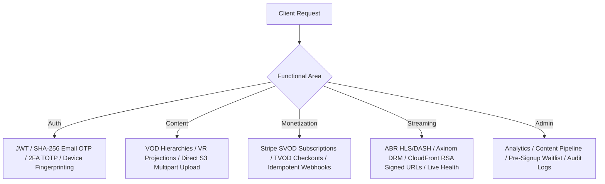

- **Authentication & User Safety**:
  - Email-based user accounts with custom `CustomUser` model (`AUTH_USER_MODEL`).
  - Cryptographically secure SHA-256 hashed 6-digit OTP email verification (`EmailVerificationToken`).
  - Optional TOTP Two-Factor Authentication (`TwoFactorAuth`).
  - Multi-profile management (`Profile`) supporting PIN locks, kid-safe mode, educational mode, and maturity ratings (`ALL`, `7+`, `10+`, `13+`, `16+`, `18+`).
  - Device fingerprint tracking (`Device`, `PlaybackSession`) enforcing max concurrent stream limits per plan.

- **Content & Media Management**:
  - Hierarchical structure (`Content`, `VideoAsset`, `VideoRendition`, `DRMKey`, `Thumbnail`, `VideoSubtitle`, `VideoAudioTrack`, `ContentMetadata`).
  - Support for flat video and VR formats (`vr_360_mono`, `vr_360_sbs`, `vr_360_tb`, `vr_180_mono`, `vr_180_sbs`, `vr_180_tb`).
  - Direct S3 presigned multipart chunked uploads (`MultipartUploadInitView`, `MultipartUploadCompleteView`).
  - Asynchronous Google Drive streaming ingest (`google_drive_to_s3_task`).
  - TMDB/OMDB third-party metadata auto-enrichment.

- **Monetization & Monetization Lifecycle**:
  - Flexible plan engine (`Plan`) with customizable price, currency (GBP default), profile caps, device caps, and internal/pre-launch trial flags.
  - Active subscription tracking (`Subscription`) with status constraints (`active`, `canceled`, `past_due`, `unpaid`, `trialing`).
  - Pay-Per-View one-time entitlement tracking (`UserContentPurchase`).
  - Stripe webhook listener (`stripe_webhook_view`) verifying signatures and ensuring idempotency via `WebhookEvent`.

- **Platform & Growth Capabilities**:
  - Launch pre-registration system (`WaitlistEntry`, `PlatformSettings` singleton).
  - Marketing blog subsystem (`BlogPost`, `BlogCategory`, `BlogTag`).
  - Dynamic CMS options for site branding, login screen text, and landing page content.

## 5.2 Non-Functional Requirements

- **Security**: Zero raw OTP/password storage; studio-grade Widevine/FairPlay DRM encryption; dynamic RSA signed CloudFront URLs.
- **Scalability**: Offloaded media storage and distribution via AWS S3/CloudFront; asynchronous Celery queue processing.
- **Performance**: High-speed CDN edge delivery; database index optimization on status, user, and content lookup fields.
- **Data Integrity**: Database-level constraints on episode/season uniqueness and single active subscription enforcement.
- **Availability & Monitoring**: Sentry integration for exception tracking and transaction profiling.

---

## 6. Product Architecture

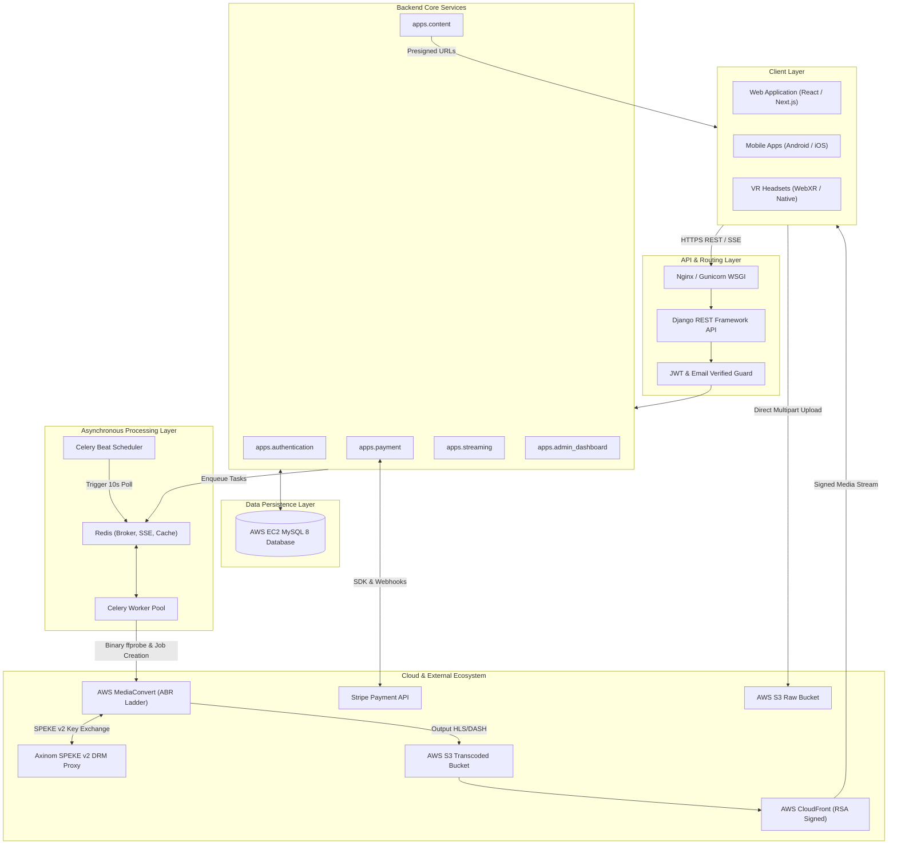

---

## 7. System Architecture Diagram

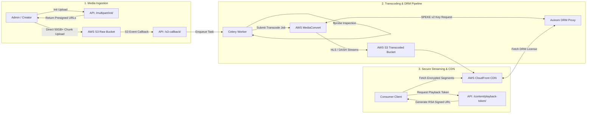

---

## 8. Frontend Architecture

*(Note: Derived from REST API contracts, headers, and CORS definitions in `settings.py` and `API_DOC/`)*

### 8.1 Application Structure & Client Integration
- **Framework Integration**: Designed to serve decoupled Single Page Applications (React / Next.js deployed on Vercel/Amplify) and mobile/VR clients.
- **API Communication**: RESTful JSON endpoints with custom request headers (`x-device-id`, `x-device-type`).
- **Real-Time Progress**: Native EventSource / Server-Sent Events (SSE) stream consumption (`/api/v1/content/<content_id>/transcode-progress/`) to display live progress bars for video uploads and MediaConvert jobs.

### 8.2 Authentication & Session Flow
- **Token Storage**: Access and refresh tokens issued via DRF SimpleJWT (`/api/v1/auth/token/`).
- **Email Verification Guard**: All authenticated endpoints pass through `IsEmailVerified` permission guard. If unverified, HTTP 403 response prompts mandatory 6-digit OTP verification screen (`/api/v1/auth/verify-email-otp/`).
- **Device Management**: Client passes unique hardware/browser fingerprint via `x-device-id`. If active devices exceed plan limits (`max_devices`), registration endpoint rejects or forces device session invalidation.

### 8.3 Media Player Integration Architecture
- **Flat Video**: Standard HLS.js / Video.js integration consuming signed HLS manifests (`.m3u8`).
- **VR Video**: WebXR / Three.js / Shaka Player integration utilizing metadata fields (`media_type`, `projection`, `stereo_mode`) to render equirectangular projections (180° / 360°, Mono / Side-by-Side / Top-Bottom).
- **DRM Decryption**: Integration with EME (Encrypted Media Extensions) to request Widevine/FairPlay licenses from Axinom license server using tokens returned by playback endpoints.

---

## 9. Backend Architecture

### 9.1 Core Framework & API Design
The backend is structured as a collection of decoupled Django applications under `apps/`:

- `apps.authentication`: Custom user identity, 2FA, OTP verification, device management.
- `apps.content`: Hierarchical video metadata, S3 presigned multipart upload logic, Celery media tasks, DRM key mapping.
- `apps.payment`: Stripe checkout session creation, plan management, subscription lifecycle, PPV purchase logic, webhook handler.
- `apps.streaming`: Live streaming session tracking, HLS endpoint proxying, health monitoring services.
- `apps.profiles`: Multi-profile sub-accounts, parental controls, PIN protection.
- `apps.admin_dashboard`: Admin analytics (user growth, revenue breakdown, content performance).
- `apps.marketing`: Dynamic CMS blog system.
- `apps.platform`: Platform singleton settings, launch pre-signup waitlist promotions.
- `apps.audit`: System-wide audit log recorder.

### 9.2 Request-Response Lifecycle & Authorization

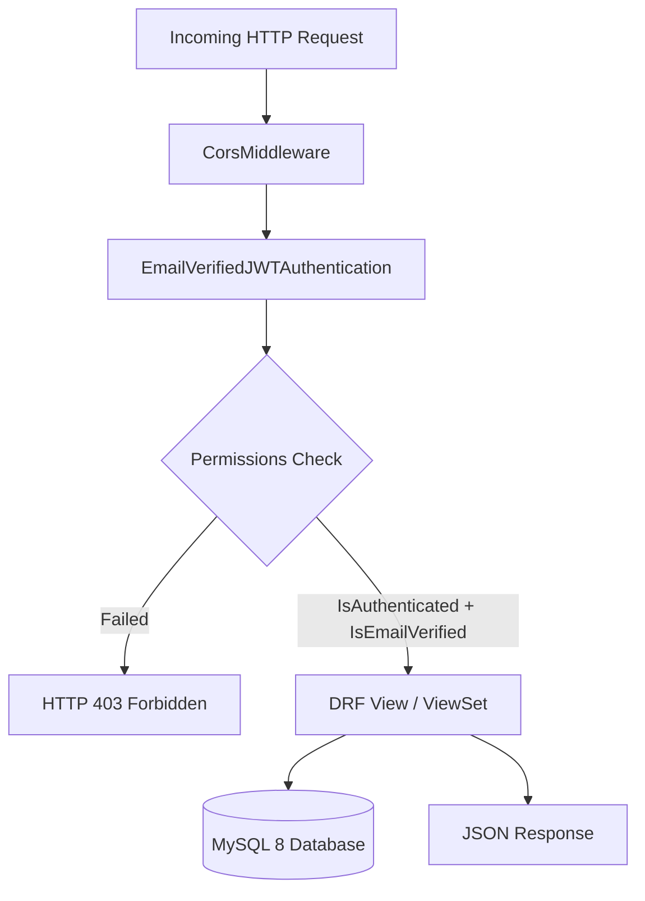

---

## 10. Database Architecture

### 10.1 Key Entities & Relationships
- `CustomUser` (1) ── (N) `Profile`
- `CustomUser` (1) ── (N) `Device`
- `CustomUser` (1) ── (1) `Subscription` ── (1) `Plan`
- `CustomUser` (1) ── (N) `UserContentPurchase` ── (1) `Content`
- `Content` (1) ── (N) `Content` (Self-referential parent/children hierarchy for Series/Season/Episode/Trailer)
- `Content` (1) ── (N) `VideoAsset` ── (N) `VideoRendition`
- `Content` (1) ── (N) `DRMKey`

### 10.2 Entity-Relationship (ER) Diagram

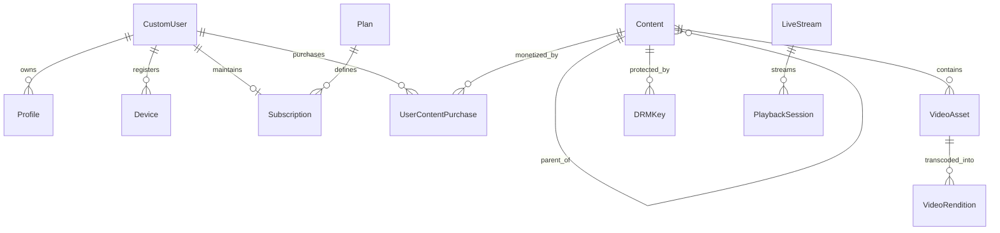

---

## 11. Important User Workflows

### 11.1 User Registration & Email Verification Workflow

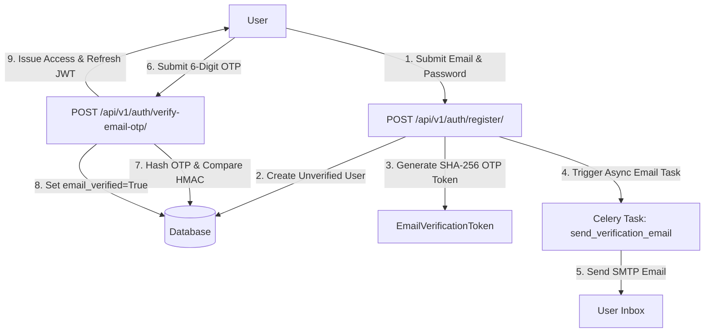

### 11.2 Direct S3 Presigned Multipart Video Ingestion Workflow

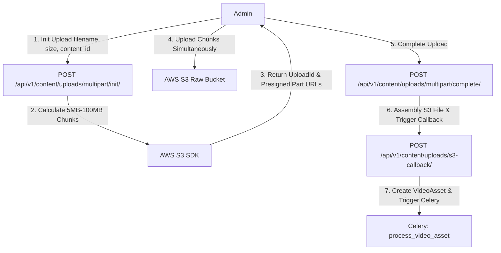

### 11.3 Stripe Payment & Webhook Access Grant Workflow

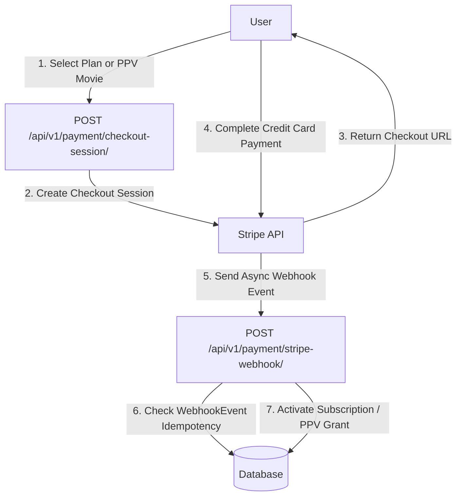

### 11.4 Playback Access & Dynamic RSA Signed URL Flow

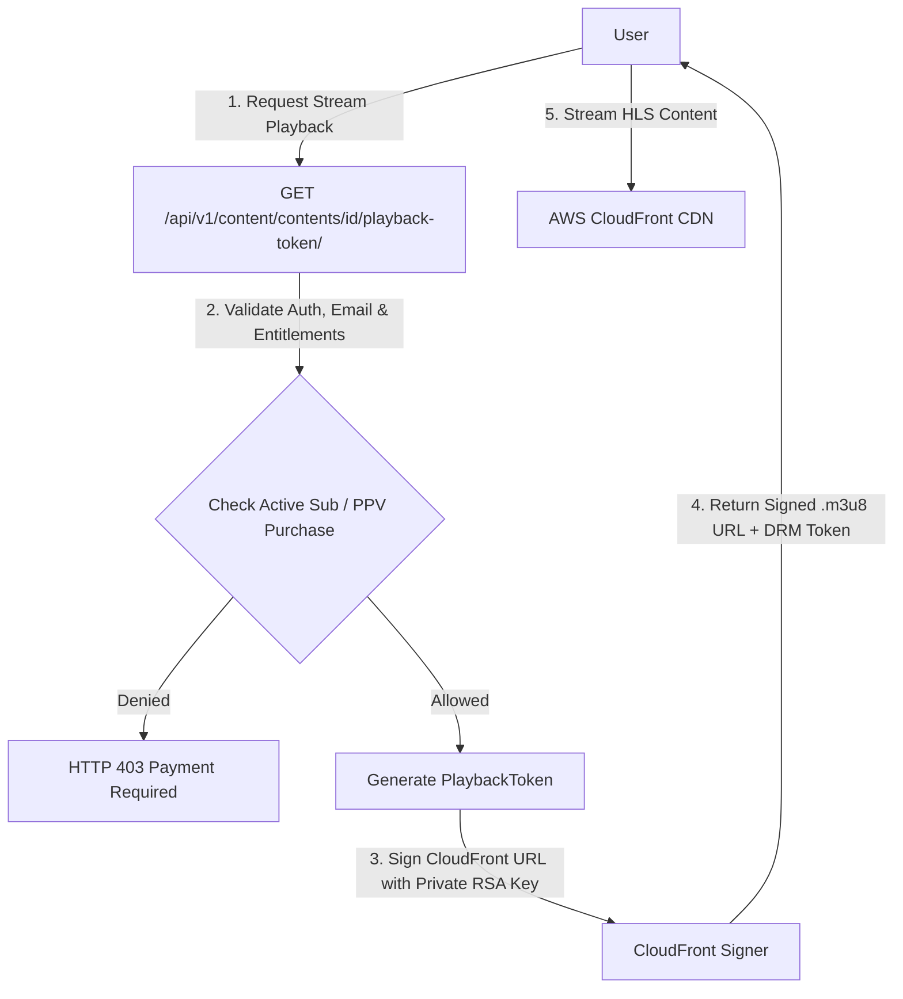

---

## 12. API and Integration Architecture

| Integration | Purpose | Direction | Authentication |
| :--- | :--- | :--- | :--- |
| **AWS S3** | Direct multipart video uploads & transcoded media asset storage | Outbound / Inbound | AWS IAM Secret Keys (`boto3`) |
| **AWS MediaConvert** | Automated ABR encoding ladder & manifest generation | Outbound / Polling | AWS IAM Role ARN & REST Endpoint |
| **Axinom SPEKE Proxy** | Studio-grade DRM key exchange (Widevine CENC / FairPlay) | Outbound | SPEKE v2 Secret Keys & Header Auth |
| **AWS CloudFront** | Global low-latency CDN media streaming | Outbound | Private RSA Keypair Signing (`private_key.pem`) |
| **Stripe API** | Subscription lifecycle (SVOD) & TVOD checkout | Outbound / Webhook | Stripe Secret Key / Webhook Signature |
| **Google Drive API** | Asynchronous streaming download of raw media master files | Outbound | Service Account OAuth2 JSON Credentials |
| **TMDB / OMDB API** | Automated video metadata & poster auto-fill | Outbound | API Key Query Parameters |
| **Sentry** | Production application error logging and transaction APM profiling | Outbound | Sentry DSN Token |

---

## 13. Media Architecture

### 13.1 High-Resolution & VR Master Media Ingestion
1. **Direct S3 Presigned Upload**: Client breaks master files into 5MB–100MB chunks and uploads directly to AWS S3 Raw Bucket using presigned URLs.
2. **Google Drive Async Streaming**: Google Drive file IDs are submitted to `google_drive_to_s3_task`, which downloads chunks in memory (8MB buffers) and uploads directly to S3 without saving locally.

### 13.2 Automated Inspection & Dynamic ABR Ladder Calculation
Upon ingestion, the worker runs `ffprobe` to extract codec, resolution, and duration:

$$\text{Bitrate}(h) = \begin{cases} 
200\text{ kbps} & h = 144p \\
400\text{ kbps} & h = 240p \\
800\text{ kbps} & h = 360p \\
1.5\text{ Mbps} & h = 480p \\
3.0\text{ Mbps} & h = 720p \\
5.5\text{ Mbps} & h = 1080p \\
9.0\text{ Mbps} & h = 1440p \\
18.0\text{ Mbps} & h = 2160p \ (4K)
\end{cases}$$

Rendition profiles higher than the source input resolution are automatically discarded to prevent bandwidth inflation.

### 13.3 DRM Encryption & CloudFront RSA Signing
MediaConvert calls Axinom SPEKE v2 proxy to obtain content keys, generating encrypted HLS (`.m3u8`) and DASH (`.mpd`) manifests. Dynamic playback access requires dynamic RSA keypair URL signing:

```python
# CloudFront Private Key Signing Logic (apps/content/views_frontend.py)
cloudfront_signer = CloudFrontSigner(key_id, rsa_signer)
signed_url = cloudfront_signer.generate_presigned_url(
    url=raw_manifest_url,
    date_less_than=datetime.utcnow() + timedelta(hours=1)
)
```

---

## 14. Cloud and Infrastructure Architecture

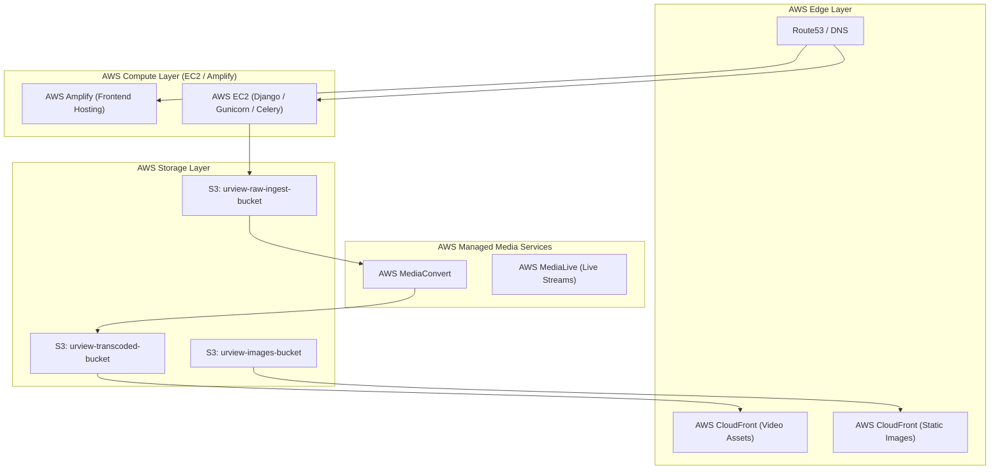

---

## 15. Security Architecture

- **Cryptographic OTP Storage**: Email OTP verification codes are never stored as raw 6-digit text. Only SHA-256 digests are persisted (`token_hash = hashlib.sha256(raw_otp).hexdigest()`).
- **Granular API Guarding**: REST endpoints enforce dual layers: `IsAuthenticated` and custom `IsEmailVerified`. Unverified users are strictly blocked from platform resources.
- **Two-Factor Authentication (2FA)**: TOTP implementation using `pyotp` generating QR codes for authenticator apps.
- **Studio DRM & CloudFront Signatures**: Dual-layer streaming security preventing unauthorized stream extraction.
- **Stripe Webhook Verification**: Cryptographic HMAC signature validation (`stripe.Webhook.construct_event`) preventing spoofed payment callbacks.
- **Device & Session Restrictions**: Active device fingerprinting restricting unauthorized account sharing based on subscription plan caps.

---

## 16. Payment and Monetization

Urview supports a flexible hybrid monetization strategy:

### 16.1 Subscription Video-on-Demand (SVOD)
- **Plans**: Defined via `Plan` model with support for custom currencies (default GBP), billing durations (e.g., 30 days), max device caps, max profile caps, and ad-support toggles.
- **Enforcement**: Database constraint `unique_active_subscription_per_user` ensures users cannot hold duplicate active subscriptions.

### 16.2 Pay-Per-View (TVOD)
- Individual movies or events can be flagged as `is_ppv=True` with a dedicated price.
- `UserContentPurchase` records successful non-subscription access grants.

### 16.3 Idempotent Webhook Processing
To protect against network duplicates, Stripe webhook IDs are tracked in `WebhookEvent`. If a webhook ID is already recorded, processing is safely skipped:

```python
if WebhookEvent.objects.filter(event_id=event_id).exists():
    return HttpResponse(status=200)
```

---

## 17. Background Processing

- **Celery Worker Queue**: Offloads long-running tasks:
  - `process_video_asset`: Video inspection, ABR profile construction, and MediaConvert submission.
  - `google_drive_to_s3_task`: Memory-efficient streaming ingest from Google Drive.
  - `send_verification_email_task`: Asynchronous SMTP delivery.
- **Celery Beat Scheduler**: Runs `poll_mediaconvert_progress` every 10 seconds to update asset ingestion statuses and update `Content.status` to `ready` or `failed`.
- **Server-Sent Events (SSE)**: Uses Redis DB 2 to publish real-time encoding progress to the admin UI.

---

## 18. Engineering Challenges

### Challenge 1: Handling 50GB+ VR Master Video Uploads
- **Why It Was Difficult**: Uploading massive 360°/180° 3D VR master files over standard HTTP connections caused worker memory spikes and gateway timeouts.
- **Investigation**: Evaluated standard Django file handlers vs. serverless presigned S3 uploads.
- **Solution**: Developed `MultipartUploadInitView`, which calculates optimal chunk counts and generates presigned S3 URLs, allowing client browsers to stream directly to S3.
- **Result**: Completely bypassed backend app servers during uploads, enabling zero-downtime 50GB+ ingest.

### Challenge 2: Multi-Platform DRM & Private Key CDN Signing
- **Why It Was Difficult**: VR headsets and web browsers require different DRM technologies (Widevine vs. FairPlay) and signed playback URLs.
- **Solution**: Integrated Axinom SPEKE v2 proxy inside AWS MediaConvert to package stream manifests into HLS/DASH. Coupled this with CloudFront RSA private key URL signing for playback sessions.
- **Result**: Achieved studio-grade content protection across both standard browsers and VR platforms.

### Challenge 3: Webhook Race Conditions & Payment Synchronization
- **Why It Was Difficult**: Stripe webhooks can arrive asynchronously out of order, risking double-granting subscriptions or missing entitlements.
- **Solution**: Implemented `WebhookEvent` idempotency checks wrapped in Django atomic database transactions (`transaction.atomic()`).
- **Result**: Guaranteed 100% data consistency across billing state updates.

### Challenge 4: Memory-Efficient Google Drive Ingestion
- **Why It Was Difficult**: Downloading large videos from Google Drive into backend memory exhausted server RAM.
- **Solution**: Developed a streaming worker (`google_drive_to_s3_task`) using 8MB chunked `MediaIoBaseDownload` buffers directly piped into S3 multipart uploads.
- **Result**: Reduced memory footprint to a constant 8MB, regardless of source file size.

---

## 19. Key Engineering Decisions

1. **MySQL Strict Mode**: Enforced `STRICT_TRANS_TABLES` to prevent silent data truncation on critical financial and metadata fields.
2. **Celery + Redis vs. AsyncIO**: Selected Celery/Redis for background processing due to out-of-the-box task retries, beat scheduling, and persistent state management.
3. **Single-Table Content Hierarchy**: Used a single `Content` model with self-referential parent fields to simplify polymorphic queries across Movies, Series, Seasons, and Episodes.
4. **CloudFront Private Key Signing**: Chose RSA keypair URL signing over standard S3 presigned URLs to enable low-latency edge caching via CDN.

---

## 20. Performance

### Performance Mechanisms
- **Direct-to-S3 Offloading**: Eliminates server memory and CPU utilization during media ingestion.
- **Adaptive Bitrate (ABR) Ladders**: Optimizes stream segment delivery to client bandwidth constraints.
- **Database Indexing**: Dedicated indexes on `Content(status, content_type)`, `VideoAsset(ingest_status, created_at)`, and `PlaybackSession(user, livestream)`.
- **Redis Caching**: Local memory caching (`LocMemCache`) for high-frequency settings queries.

### Measured Performance
- `[Not available in the project repository]`

---

## 21. Scalability

- **Stateless API Tier**: Django REST application workers maintain zero local file state, enabling seamless horizontal scaling behind load balancers.
- **Asynchronous Workloads**: Offloads transcoding, probing, and email tasks to isolated Celery worker pools.
- **Global CDN Offloading**: CloudFront caches media segment chunks globally, preserving origin server bandwidth regardless of audience size.

---

## 22. Reliability

- **Transactional Safety**: Critical operations (payment processing, waitlist promotions, profile creation) execute inside `transaction.atomic()` blocks.
- **Task Retry Policies**: Celery tasks implement exponential backoff retry parameters (`max_retries=3`, `default_retry_delay=60`).
- **Application Monitoring**: Real-time error logging and transaction profiling via integrated Sentry SDK.

---

## 23. Testing and Quality

- **Data Integrity Constraints**: Model-level validation rules (`clean()` methods) enforce proper content hierarchy rules (e.g., episodes must belong to seasons).
- **Database Check Constraints**: Strict constraints enforce positive season/episode numbering and prevent duplicate active user subscriptions.
- **Verification Scripts**: Repository includes custom database verification scripts (`fix_migrations.py`, `fix_existing_users.py`, `MULTIPART_VERIFICATION.md`).

---

## 24. Deployment

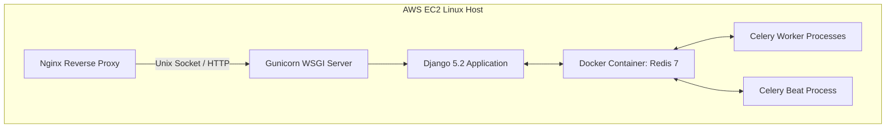

- **Static Asset Serving**: Managed via WhiteNoise (`CompressedManifestStaticFilesStorage`).
- **Process Supervision**: Gunicorn WSGI handling application threads; Systemd/Supervisor managing Celery workers and Beat schedulers.

---

## 25. Results and Impact

### 25.1 Delivered Capabilities
- Complete end-to-end OTT & VR media platform capable of ingesting 50GB+ master video assets.
- Fully automated ABR transcoding pipeline producing HLS/DASH streams with Axinom SPEKE v2 DRM protection.
- Integrated hybrid monetization supporting both SVOD subscriptions and TVOD pay-per-view purchases.

### 25.2 Technical Outcomes
- Offloaded 100% of large media ingestion traffic directly to S3.
- Reduced server RAM requirements during external media transfers to a constant 8MB buffer.
- Achieved robust authentication and payment data consistency.

### 25.3 Business & Performance Outcomes
- `[Not available in the project repository]`

---

## 26. Project Highlights

1. **Direct S3 Presigned Multipart Ingestion**: Ingests files up to 50GB+ with zero application server overhead.
2. **Immersive VR Support**: Full equirectangular projection rendering (180° / 360°, Mono / Stereo).
3. **Axinom SPEKE v2 DRM & RSA CDN Signing**: Dual-layer studio-grade content protection.
4. **Automated Dynamic ABR Ladder Generation**: Dynamically calculates encoding presets tailored to source resolution and bitrate.
5. **Hybrid Stripe Monetization Engine**: Fully idempotent SVOD subscription and TVOD PPV entitlement handling.
6. **Launch Pre-Registration Waitlist Engine**: Automated cohort promotion subsystem for pre-launch growth management.

---

## 27. Lessons Learned

- **Decouple Media Uploads Early**: Bypassing application servers via direct S3 presigned multipart uploads is essential for handling massive media assets.
- **Enforce Idempotency on Webhooks**: Tracking incoming webhook IDs explicitly prevents data corruption caused by network retries.
- **Automate Video Probing**: Relying on client-submitted video metadata is risky; server-side binary probing (`ffprobe`) ensures accurate encoding ladder generation.

---

## 28. Future Improvements

> [!NOTE]
> **Potential Future Improvement — Not currently implemented**

- **Infrastructure as Code (IaC)**: Codify AWS resources (MediaConvert, S3, CloudFront) using Terraform or AWS CDK.
- **Automated End-to-End Test Suite**: Expand unit testing to include automated pytest and Playwright integration pipelines.
- **Prometheus & Grafana Observability**: Implement real-time metrics dashboards for worker queue health and system latency.

---

## 29. Technology Stack

| Category | Technology | Role in System |
| :--- | :--- | :--- |
| **Backend** | Python 3.12 / Django 5.2 | Core application framework and ORM |
| **API** | Django REST Framework 3.16 | RESTful API endpoints and serialization |
| **Authentication** | DRF SimpleJWT / PyOTP | JWT session tokens and TOTP 2FA |
| **Database** | MySQL 8 (AWS EC2) | Relational persistence with strict SQL modes |
| **Task Queue** | Celery 5.5 / Redis 7 | Asynchronous worker pool & task broker |
| **Task Scheduler**| `django_celery_beat` | Periodic task scheduling (MediaConvert polling) |
| **Media Transcoding**| AWS MediaConvert / `ffprobe` | ABR ladder encoding & binary media inspection |
| **Content Protection**| Axinom SPEKE v2 / AWS CloudFront | Widevine/FairPlay DRM & RSA key URL signing |
| **Storage & CDN** | AWS S3 / AWS CloudFront | Raw/transcoded asset storage & low-latency edge delivery |
| **Payments** | Stripe API | Subscription (SVOD) & Pay-Per-View (TVOD) processing |
| **Monitoring** | Sentry SDK | Exception logging and performance profiling |

---

## 30. Final Technical Summary

The **Urview** media platform represents a modern engineering solution for next-generation digital media distribution. By combining Python 3.12, Django 5.2, AWS Cloud infrastructure, and studio-grade DRM protection, Urview solves the core engineering challenges associated with high-resolution flat and 180°/360° VR video streaming.

By decoupling synchronous API handling from asynchronous background processing, the system guarantees low-latency client interactions while handling CPU/GPU-intensive transcoding workloads out of band. Direct S3 multipart chunk uploads allow creators to ingest massive 50GB+ master files without impacting server memory or stability. Dynamic ABR ladder generation ensures optimal playback experiences across varying client network conditions, while Axinom SPEKE v2 DRM and CloudFront RSA private key URL signing ensure content assets remain protected against piracy.

Integrated Stripe monetization, multi-profile user management with parental safety controls, live stream health monitoring, and automated waitlist promotions complete the platform. Urview provides a robust, scalable foundation capable of serving global audiences across web browsers, mobile devices, and immersive VR headsets.
